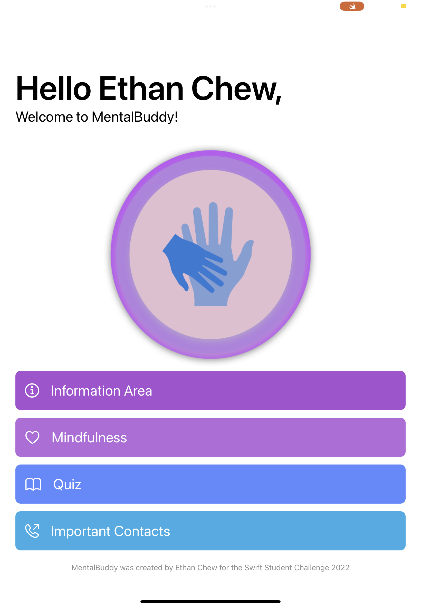
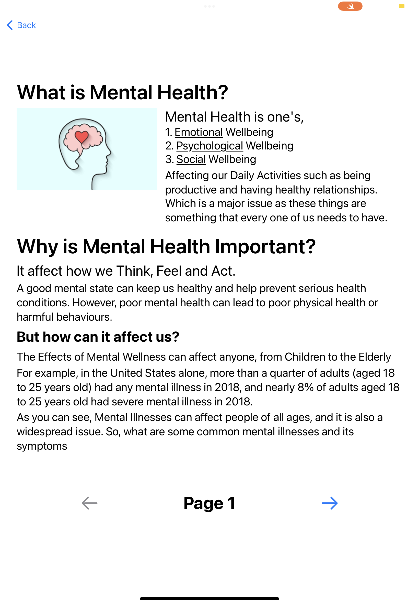
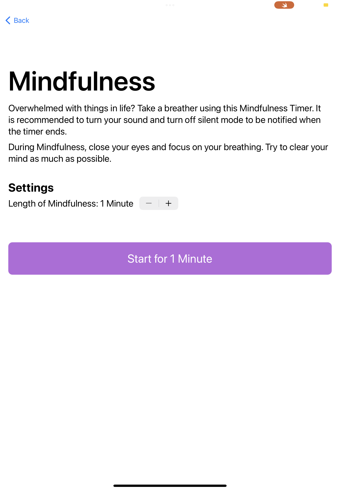
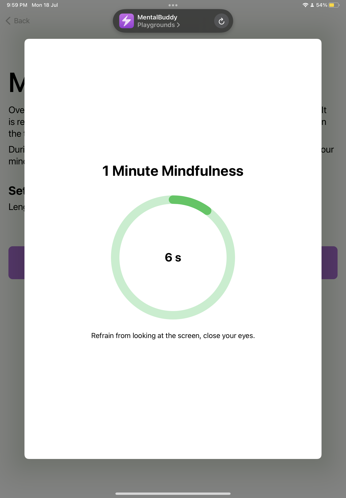
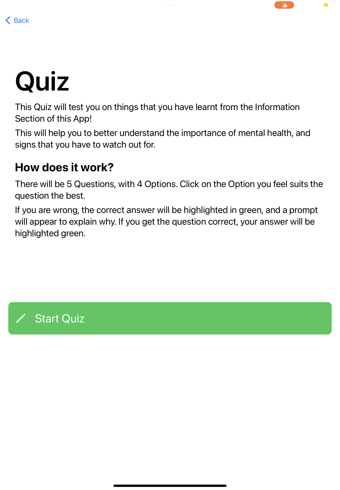
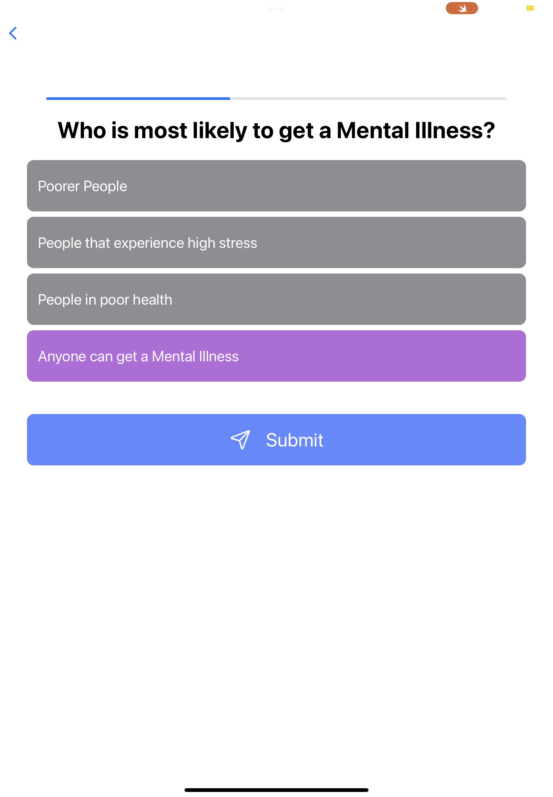

# Mental Buddy
Mental Buddy was developed as I realised the prevalence of poor mental wellness worldwide and a lack of understanding of mental wellness. Mental Buddy helps educate people on the importance of maintaining good mental wellness, providing statistics relating to mental health, symptoms of mental illnesses, common mental illnesses that people face and ways to improve one's mental wellness.
Mental Buddy has a few key features, including an information booklet about Mental Health, a Mindfulness Timer, a Quiz and a list of helplines.

## App Screenshots

  

## Features
### 1. Information Booklet
The Information Booklet contains useful information that everyone should know. The booklet contains information such as  
1. What is Mental Health  
2. The Importance of Mental Health  
3. Common Mental Illnesses and their Symptoms  
4. Ways that one can improve their Mental Health  
Armed with this knowledge, it will allow people to better understand what mental wellness is, allowing them to empathise with others and also know that they are not alone
### 2. Mindfulness Timer
Nowadays, people are very stressed. From work, school and home, there are many things that stress us humans daily. We should all take a break once in a while to relax and clear our minds. The Mindfulness Timer was built for just that.  
Users can set a Timer, ranging from 1 Minute to 10 Minutes, allowing them to relax, focus on their breathing and to clear their minds of any stress that they have. Once the stipulated time is up, the Timer will play a sound letting them know the Mindfulness Session is over.
### 3. Quiz
The Information Booklet is packed full of information. However, in order to retain the most information and to clarify any common questions they might have, the Quiz allows them to put their knowledge to the test, letting them learn more.
### 4. Helplines
The View with Helplines aims to provide an avenue for people who feel that they need someone to talk to. The screen provides users with a list of phone numbers that they can call, in order to talk to someone about their problems.  
## Installation
### MacOS
1. Use `git clone https://github.com/Ethan-Chew/Mental-Buddy` to clone the Project to your Local Machine
2. Locate the Directory of the Project, and open it
3. Right click the _.swiftpm_ file, and open it in Xcode (NOT Swift Playgrounds)
4. Run the Project Normally
### iPadOS
1. Download the git repository by clicking the Green 'Code' button and Downloading it as a _.zip_ file
2. Open the Folder using the Files app
3. Ensure that you have installed Swift Playgrounds from the App Store before continuing
4. Tap the _.swiftpm_ file, and it will open in Swift Playgrounds
5. Press the Play button to run the Project

##### Mental Buddy was developed by Ethan Chew for the Swift Student Challenge 2022
